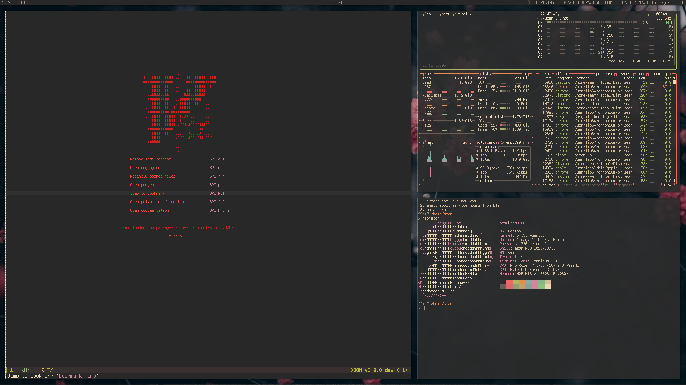

### gentoo dotfiles
Please note all of this is quite messy, I'll organize it some day 

#### details
* distro: gentoo
* app launcher: dmenu
* wm: dwm
* terminals: kitty, st
* font: Terminus Nerd Complete
* tui fm: ranger
* shell: mksh

#### more

* custom kernel (menu config)
* eudev replacing udev
* custom grub menu
* sx over xinit
* ripgrep over grep
* fd over find
* uutils over GNU coreutils
* exa over ls
* doas over sudo

